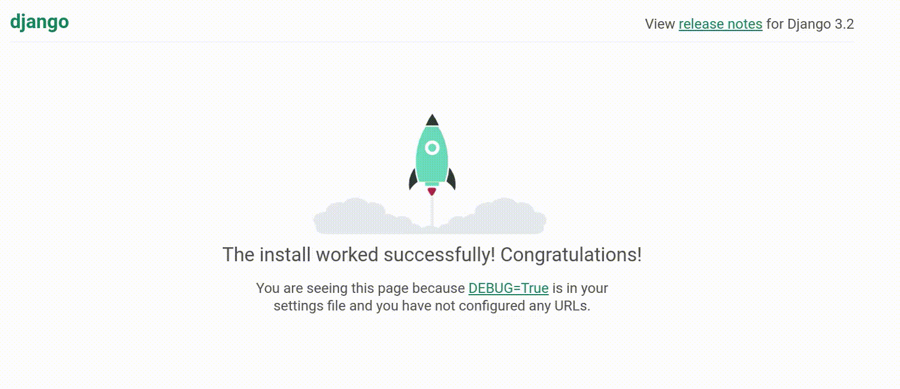
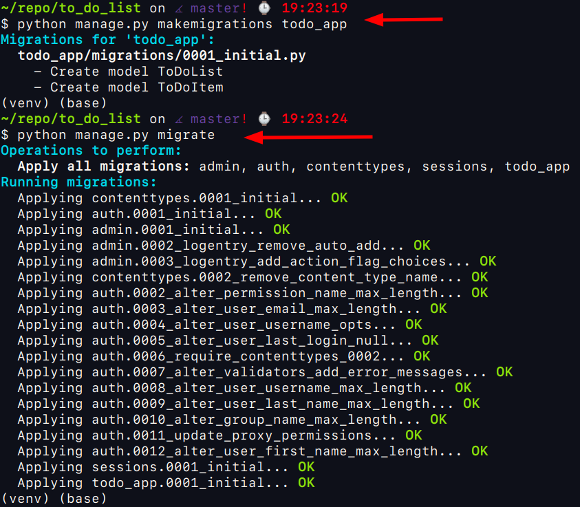
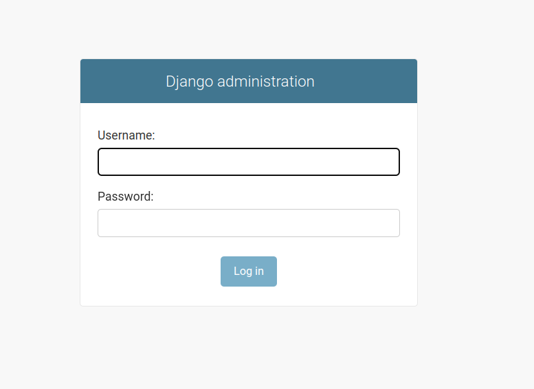

# To-Do Lists Using Python and Django

In this project I will build a Django to-do list manager ```to_do_list```. This work is based on the [Real Python Tutorial](https://realpython.com/django-todo-lists/) that is great resource to learn and sharp your skills in python.

## TODO's

- Create a web app using Django
- Build a data model with one-to-many relationships
- Use the Django admin interface to explore your data model and add test data
- Design templates for displaying your lists
- Leverage class-based views to handle the standard database operations
- Control the Django URL dispatcher by creating URL configurations

## Table of Contents

- [Demo]()
- [Project Overview]()
- [Prerequisites]()
- [Step 1: Set Up Your Virtual Environment and Django]()
  - [Create a Virtual Environment and a Project Directory]()
  - [Install and Test Django]()
- [Step 2: Create Your Django To-Do App]()
  - [Scaffold the Parent Project]()
  - [Get Started on Your Django To-Do List App]()
  - [Configure Your Project]()
- [Step 3: Design Your To-Do Data]()
  - [Define Your Data Models]()
  - [Create the Database]()
- [Step 4: Add Your Sample To-Do Data]()
  - [Meet the Django Admin Interface]()
  - [Start a To-Do List]()
- [Step 5: Create the Django Views]()
  - [Code Your First View]()
  - [Understand Templates]()
  - [Create a Base Template]()
  - [Add a Home Page Template]()
  - [Build a Request Handler]()
  - [Reuse Class-Based Generic Views]()
  - [Subclass ListView to Display a List of To-Do Items]()
  - [Show the Items in a To-Do List]()
  - [Step 6: Create and Update Model Objects in Django]()
  - [Lists and Items]()
  - [New Views]()
- [Step 7: Delete To-Do Lists and Items]()
  - [Make DeleteView Subclasses]()
  - [Define Deletion Confirmations and URLS]()
  - [Enable Deletions]()
- [Step 8: Use Your Django To-Do List App]()
- [Conclusion]()
- [Next Steps]()

## Project Overview

- **Step 1**: Set Up Your Virtual Environment and Django
```bash
# create folder
$ mkdir ~/repo/to_do_list
$ cd ~/repo/to_do_list

# activate the virtual environment
$ python -m venv venv
$ source venv/bin/activate
```

Install and Test Django
```bash
python -m pip install django=="3.2.9"
```
(**NOTE**: Maybe in the future you should install the last version of Django)

You can use the python interpreter to verify if Django has been installed correctly.

```bash
$ python                               
Python 3.9.7
>>> import django
>>> django.get_version()
'3.2.9'
>>> exit()
(venv) (base) 
```

One good idea when you are developing a project is to use ```freeze``` to get the list of packages and versions installed. We use the file text name ```requirements.txt```:

```bash
python -m pip freeze > requirements.txt
```

- **Step 2**: Create Your Django To-Do App

```bash
django-admin startproject todo_project .
```

Get Started on Your Django To-Do List App

```bash
django-admin startapp todo_app
```

After start the app is necessary to configure your project, you need to ```'todo_app'``` to the file ```todo_project/settings.py```

Below where you need add the ```'todo_app'```:

```bash
INSTALLED_APPS = [
    'django.contrib.admin',
    'django.contrib.auth',
    'django.contrib.contenttypes',
    'django.contrib.sessions',
    'django.contrib.messages',
    'django.contrib.staticfiles',
    'todo_app',  # ADDED TODO APP! <<<<
]
```

The DATABASES is set up by default to use the ```sqlite3``` database.

- **SECRET_KEY** is important if you plan to put your app on a public server. Django generates a new random SECRET_KEY for every new project. **You can ignore it for now**.

The second thing to do is to modify the file in the project folder call ```urls.py```, located in the ```todo_project/urls.py```

Here How to do this:

```bash
# file - todo_project/urls.py
from django.contrib import admin
from django.urls import include, path

urlpatterns = [
    path("admin/", admin.site.urls),
    path("", include("todo_app.urls")) # Add path to the app
]
```

You will create that app-level URL configuration file now. Open a new file in your editor and save it in the ```todo_app``` directory under the name ```urls.py```:


```bash
# todo_app/urls.py
urlpatterns = [
]
```

You can test your work so far by starting the Django development server:


```bash
$ python manage.py runserver
Watching for file changes with StatReloader
Performing system checks...

System check identified no issues (0 silenced).

You have 18 unapplied migration(s). Your project may not work properly until you apply the migrations for app(s): admin, auth, contenttypes, sessions.
Run 'python manage.py migrate' to apply them.
March 27, 2022 - 14:56:07
Django version 3.2.9, using settings 'todo_project.settings'
Starting development server at http:....
```

After this command you need to open the browser tip your localhost at the URL and you will see the image below and the message ```The install worked successfully! Congratulations!```:




Django’s default page provides links to lots of helpful documentation. 

You’ve completed all the standard setup tasks for a new Django app. It’s time to start coding the unique features of your application.

- **Step 3**: Design Your To-Do Data

Define Your Data Models. Open the file models.py in your editor and change to the source code below:

```bash
# todo_app/models.py
from django.utils import timezone

from django.db import models
from django.urls import reverse

def one_week_hence():
    return timezone.now() + timezone.timedelta(days=7)

class ToDoList(models.Model):
    title = models.CharField(max_length=100, unique=True)

    def get_absolute_url(self):
        return reverse("list", args=[self.id])

    def __str__(self):
        return self.title

class ToDoItem(models.Model):
    title = models.CharField(max_length=100)
    description = models.TextField(null=True, blank=True)
    created_date = models.DateTimeField(auto_now_add=True)
    due_date = models.DateTimeField(default=one_week_hence)
    todo_list = models.ForeignKey(ToDoList, on_delete=models.CASCADE)

    def get_absolute_url(self):
        return reverse(
            "item-update", args=[str(self.todo_list.id), str(self.id)]
        )

    def __str__(self):
        return f"{self.title}: due {self.due_date}"

    class Meta:
        ordering = ["due_date"]
```

Now save the models.py file with its two model classes. With this file, you’ve just declared the data model for the entire app. Soon, you’ll use Django tooling to map the model to your database.

### Create the Database

So far, you’ve defined the two model classes in your Python code. Now the magic happens! Use the command line to create and activate the [migrations](https://realpython.com/django-migrations-a-primer/):

```bash
$ python manage.py makemigrations todo_app
$ python manage.py migrate
```



Your data model is now mirrored in the database, and you’ve also created an audit trail in preparation for any structural changes that you may apply later.

- **Step 4**:  Add Your Sample To-Do Data

So now you have a data model and a database, but you don’t yet have any actual data in the form of to-do lists or items. Soon, you’ll be building web pages to create and manipulate these, but for now, you can create a little test data in the easiest way, by using Django’s ready-made admin interface. This tool enables you not only to manage model data, but also to authenticate users, display and handle forms, and validate input.

### Meet the Django Admin Interface

To use the admin interface, you should have a **superuser**. This will be someone with extraordinary powers who can be trusted with the keys to the whole Django server. Does this sound like you? Create your new **superuser** now:

```bash
$ python manage.py createsuperuser
Username (leave blank to use): 
Email address: 
Password: 
Password (again): 
Superuser created successfully.
```

Just follow the prompts to register yourself as a superuser. Your superpowers are installed!

Although you now have access to the admin interface, there’s one more step to complete before it can make use of your new data models. You need to register the models with the admin app, which you can do by editing the file admin.py:

```bash
# todo_app/admin.py

from django.contrib import admin
from todo_app.models import ToDoItem, ToDoList

admin.site.register(ToDoItem)
admin.site.register(ToDoList)
```

And now you’re ready to use the Django administration app. Launch the development server and start exploring. First, make sure the development server is running:

```bash
$ python manage.py runserver
```



Now open a web browser and go to the address http://XXX.X.X.X:XXXX/admin/. You should see the admin app’s login screen. Enter your newly minted credentials, and the admin landing page appears:


Notice that it already displays links for To do lists and To do items. You’re ready to view and change the data.

### Start a To-Do List


## Resources

- [Django documentation](https://docs.djangoproject.com/en/4.0/)
- [Django Migrations: A Primer](https://realpython.com/django-migrations-a-primer/)